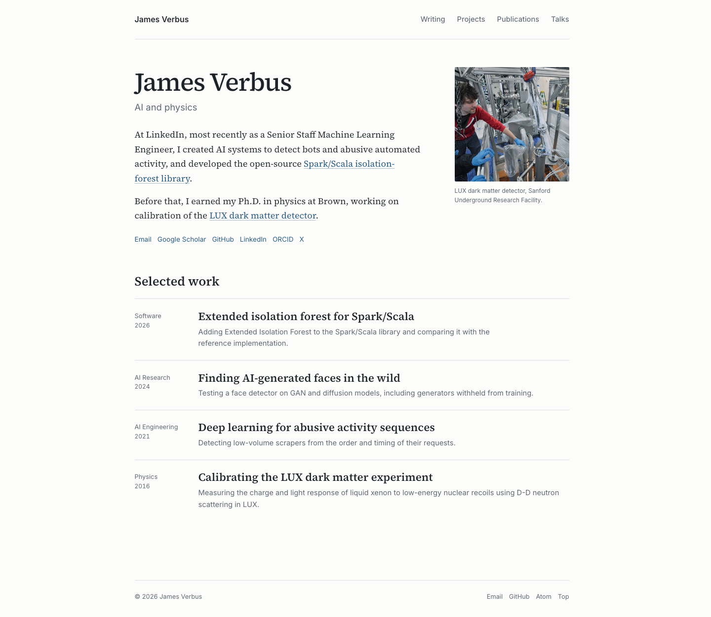

# Academic redesign — September 7, 2026

The homepage introduces James Verbus with **AI and physics**, a short biography, the
existing LUX photograph and caption, and four selected works. The full writing, project,
publication and talk collections remain available through text navigation. The palette
uses near-white, charcoal and blue, with a graphite dark mode.

## Implementation

| Area | Result |
| --- | --- |
| Identity | Name as the main heading, with “AI and physics” directly below it. Biography emphasizes AI for detecting bots and abusive automated activity, followed by the open-source library and Brown/LUX background. |
| Homepage | Replaces the slogan, metric strip, route cards, repeated collection previews and contact button with an introduction and four work entries. Existing home fragment targets remain available. |
| Selected work | `_data/home.yml` lists the 2026 Extended Isolation Forest article, generated-face detection (AI Research, 2024), activity-sequence detection (AI Engineering, 2021) and LUX calibration (Physics, 2016). All entries have a year. Descriptions reuse existing technical copy. |
| Navigation | Writing, Projects, Publications and Talks are text links. All four remain visible on mobile without JavaScript. `/videos/` remains the Talks URL. |
| Typography | Existing vendored Source Serif 4 and Inter, with aligned headings, comfortable reading text and subdued metadata. No new fonts or dependencies. |
| Collections and posts | Open lists replace raised cards. Article headers, links, contact controls and footers use the quieter presentation. Tables, figures, MathML, code and demos retain their substance and functionality. |
| Castle | Existing source, assets, rendered page/head and its own index/feed entries are preserved. The shared URL exception keeps its original navigation, footer, theme metadata and `loop54` stylesheet URL. |

The new styles are scoped to `.academic`, which is added outside Castle's source.
The original CSS rules remain intact in the same stylesheet; this intentional additive
approach preserves Castle's appearance. Other pages use `loop55`. Homepage structured
data uses the new home description. The old configuration tagline remains available for
Castle's original footer.

The selected software entry points to the 2026 EIF article to show recent development.
That article links to the original 2019 work; the biography still links directly to the
library's project page. Its displayed 2026 date belongs to the featured article, not to
the library's creation.

This design implements the later approved homepage/footer changes. The prior editorial
review's other optional holds remain unchanged: publication counts, interview copy, and
the protected face/LUX passages. Post sources and publication/talk data were not edited.

## Preservation and validation

Baseline: actual unchanged working tree at `15f0eb3c880b352b005f48dedbd001197f0d250c`,
built with `_config.yml,_config.ci.yml`, saved outside the repository at
`/private/tmp/academic-redesign-20260907/`. The snapshot contains 185 tracked source files,
their hashes, the complete generated site, and Castle's source/asset manifest.

- CI-config build and production build both succeed. The production validator also passes
  with `--require-absolute-site-urls`.
- `check_generated_site.py` output is byte-identical to the baseline. All 43 HTML routes
  remain; the homepage retains its old section fragment IDs.
- `check_post_og.py`: all 10 posts pass. All 32 JSON-LD blocks parse.
- Demo tests: 30 isolation-forest, 21 orbital-transfer and 12 LUX checks pass (63 total).
- `check_castle.py`: source, seven local assets, complete page/head and 20 entries across
  12 files match. The preservation checker's five regression tests pass.
- The final Castle comparison uses the same browser navigation sequence as the baseline:
  all 184 elements have identical computed styles in desktop/mobile and light/dark modes,
  and all four corresponding viewport screenshots are byte-identical.
- All ten complete rendered article subtrees match the baseline, including their headers,
  body copy, figures, equations, code, collaborator credits and AI-assistance disclosures.
- Browser review: Chrome 152, nine pages at desktop 1440×1080 and mobile 390×844, in light
  and dark modes (36 combinations). No overflowing prose, missing images or broken local
  fragment links; all three demos render with nonempty canvases.
- Seventeen additional checks cover visible navigation without JavaScript at 320/760/768
  pixels, hidden demo fallbacks, keyboard skip/navigation focus, light/dark text contrast,
  and white print output while the system is in dark mode.
  The lowest measured contrast among the homepage text styles is 5.49:1.
- CSS braces balance; `git diff --check` passes. Screenshots and this report are under
  `scripts/`, excluded from the generated site.

The browser checks use local headless Chrome because the in-app browser was unavailable.
They cover Chrome rendering; Safari and Firefox have not been exercised in this review.

## Screenshots

The “before” images show the original first viewport. The new homepage images show the
complete page; all were captured from local builds using the same viewport sizes.

| | Desktop | Mobile |
| --- | --- | --- |
| Before | [Original homepage](home-before-desktop.png) | [Original homepage](home-before-mobile.png) |
| After | [New homepage](home-after-desktop.png) | [New homepage](home-after-mobile.png) |
| Dark mode | [New homepage](home-dark-desktop.png) | [New homepage](home-dark-mobile.png) |

[Writing](writing-desktop.png) · [Publications](publications-desktop.png) ·
[LUX article](lux-desktop.png) · [LUX demo on mobile in dark mode](lux-mobile-dark.png)

